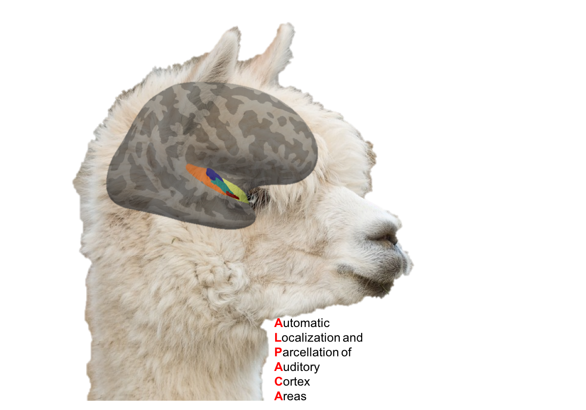

# ALPACA - Automated Localization & Parcellation of Auditory Cortex Areas

&nbsp;&nbsp;&nbsp;&nbsp;&nbsp;&nbsp;&nbsp;&nbsp;&nbsp;&nbsp;&nbsp;&nbsp;&nbsp;&nbsp;&nbsp;&nbsp;&nbsp;&nbsp;&nbsp;&nbsp;&nbsp;&nbsp;&nbsp;&nbsp;&nbsp;&nbsp;&nbsp;&nbsp;&nbsp;&nbsp;&nbsp;&nbsp;&nbsp;&nbsp;&nbsp;&nbsp;&nbsp;&nbsp;&nbsp;&nbsp;&nbsp;&nbsp;&nbsp;&nbsp;&nbsp;&nbsp;&nbsp;&nbsp;&nbsp;&nbsp;&nbsp;&nbsp;&nbsp;&nbsp;&nbsp;&nbsp;&nbsp;&nbsp;&nbsp;&nbsp;&nbsp;&nbsp; 

The ALPACA project logo was made using an amazing freely available alpaca picture from [Max Pixel](http://maxpixel.freegreatpicture.com/Pako-Mammal-Wool-Vicugna-Pacos-Alpaca-Wool-Alpaca-814953) and (cytoarchitectonic) auditory cortex ROIs from [Morosan et al.](https://www.ncbi.nlm.nih.gov/pubmed/11305897) overlaid on the right hemisphere of [freesurfer's fsaverage brain](https://surfer.nmr.mgh.harvard.edu). No alpacas were harmed during the creation of this logo.   

Please feel free to contact me wrt any question or idea via mail (herholz dot peer at gmail dot com), twitter ([@peerherholz](https://twitter.com/peerherholz?lang=eng)), the brainhack slack team (@peerherholz) or the project channel (#alpaca). 
